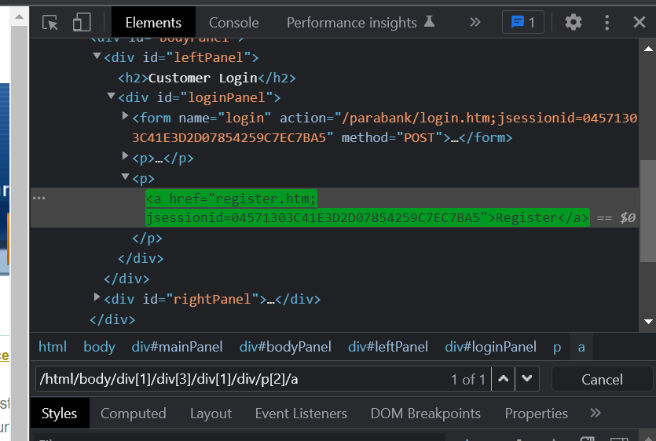

### Absolute XPath

### Source Code
```Java
package parabank;

import org.openqa.selenium.By;
import org.openqa.selenium.JavascriptExecutor;
import org.openqa.selenium.WebDriver;
import org.openqa.selenium.WebElement;
import org.openqa.selenium.chrome.ChromeDriver;
import org.testng.annotations.Test;

public class Parabank {
	
public WebDriver driver;
	
	@Test
	public void parabank() throws InterruptedException { 
		System.setProperty("webdriver.chrome.driver", "C:\\Users\\white\\Desktop\\QA\\Auto\\chromedriver.exe");
				
		driver = new ChromeDriver();
		driver.navigate().to("https://parabank.parasoft.com/parabank/index.htm");

		WebElement butElem = driver.findElement(By.xpath("/html/body/div[1]/div[3]/div[1]/div/p[2]/a"));
		butElem.click();
		Thread.sleep(4000);
		driver.close();
	}
}

```

### The Result

