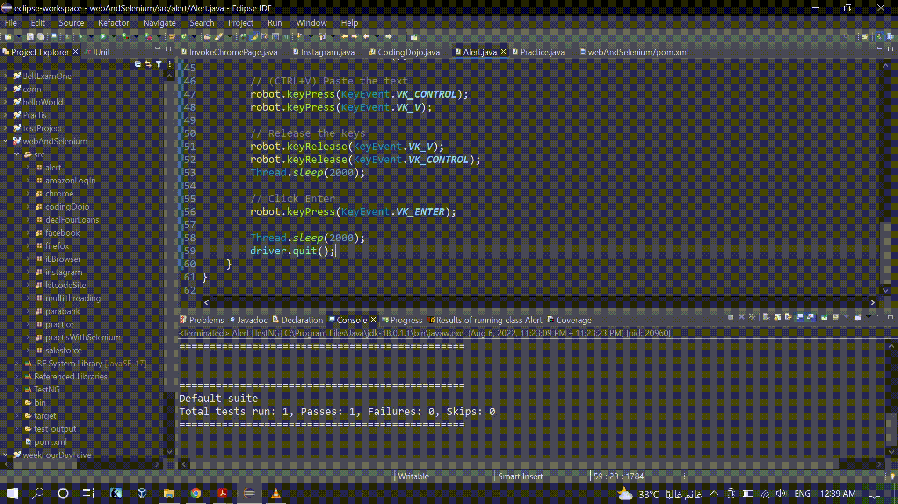

### 

### Source Code
```Java
package alert;

import java.awt.AWTException;
import java.awt.Robot;
import java.awt.Toolkit;
import java.awt.datatransfer.Clipboard;
import java.awt.datatransfer.StringSelection;
import java.awt.event.KeyEvent;

import org.openqa.selenium.By;
import org.openqa.selenium.JavascriptExecutor;
import org.openqa.selenium.Keys;
import org.openqa.selenium.WebDriver;
import org.openqa.selenium.WebElement;
import org.openqa.selenium.chrome.ChromeDriver;
import org.openqa.selenium.interactions.Actions;
import org.openqa.selenium.support.ui.ExpectedConditions;
import org.testng.annotations.Test;
import org.zeromq.ZStar.Set;


public class Alert {
	public WebDriver driver;
	
	@Test
	public void codingDojo() throws InterruptedException, AWTException {

		System.setProperty("webdriver.chrome.driver", "C:\\Users\\white\\Desktop\\QA\\Auto\\chromedriver.exe");

		driver = new ChromeDriver();
		driver.navigate().to("https://the-internet.herokuapp.com/javascript_alerts");		
		
		WebElement jsPrompt = driver.findElement(By.xpath("//button[text()='Click for JS Prompt']"));
		// Click on the button
		jsPrompt.click();
		Thread.sleep(2000);
		
		
		// Solution #1
		//org.openqa.selenium.Alert alert = driver.switchTo().alert();
		
		// Send 'Testing' to alert textBox
		//driver.switchTo().alert().sendKeys("Testing");
		//System.out.println(alert.equals(null));

		// Capturing alert message.
		//String alertMsg = driver.switchTo().alert().getText();
		

		// Displaying alert message 
		//System.out.println(alertMsg);

		// Accepting alert 
		//driver.switchTo().alert().accept();
		//==================================================//
		
		// Solution #2
		//JavascriptExecutor js = (JavascriptExecutor) driver;
		//js.executeScript("var p = prompt('I am a JS prompt', 'Testing');\r\n"
		//		+ "log('You entered: ' + p);", "arguments[0].click()", jsPrompt);
		
		//=================================================//
		
		// Solution #3
		//++++++  Solution Description: type a String using java.awt.Robot  ++++++//
		
		String text = "Testing";
		
		StringSelection stringSelection = new StringSelection(text);
		// transfer data using cut/copy/paste operations
		Clipboard clipboard = Toolkit.getDefaultToolkit().getSystemClipboard();
		// Copies the selected text to the system
		clipboard.setContents(stringSelection, stringSelection);
		
		// Robot: generate keyboard/mouse events
		Robot robot = new Robot();
		
		// (CTRL+V) Paste the text
		robot.keyPress(KeyEvent.VK_CONTROL);
		robot.keyPress(KeyEvent.VK_V);
		
		// Release the keys
		robot.keyRelease(KeyEvent.VK_V);
		robot.keyRelease(KeyEvent.VK_CONTROL);
		Thread.sleep(2000);
		
		// Click Enter
		robot.keyPress(KeyEvent.VK_ENTER);
				
		Thread.sleep(2000);
		driver.quit();
	}
}

```

### The Result
