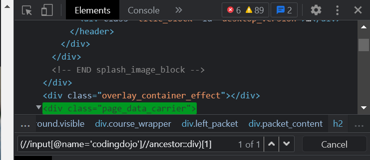
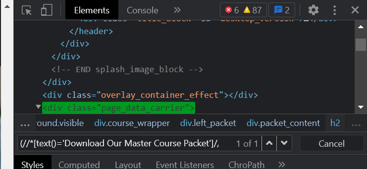
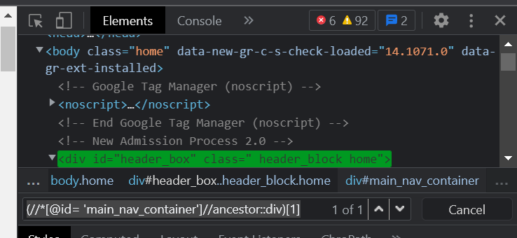

### Applying the 'Ancestor' Axes Method

### Source Code
```Java
package codingDojo;

import java.util.ArrayList;
import java.util.List;

import org.openqa.selenium.By;
import org.openqa.selenium.JavascriptExecutor;
import org.openqa.selenium.Keys;
import org.openqa.selenium.WebDriver;
import org.openqa.selenium.WebElement;
import org.openqa.selenium.WindowType;
import org.openqa.selenium.chrome.ChromeDriver;
import org.openqa.selenium.interactions.Actions;
import org.testng.annotations.Test;

public class CodingDojo {
	
public WebDriver driver;
	
	@Test
	public void codingDojo() throws InterruptedException { 
		
		System.setProperty("webdriver.chrome.driver", "C:\\Users\\white\\Desktop\\QA\\Auto\\chromedriver.exe");
				
		driver = new ChromeDriver();
		//driver.manage().window().maximize();
		driver.navigate().to("https://www.codingdojo.com/"); 
		WebElement firstEle = driver.findElement(By.xpath("(//input[@name='codingdojo']//ancestor::div)[1]"));
		WebElement secondEle = driver.findElement(By.xpath("(//*[text()='Download Our Master Course Packet']//ancestor::div)[1]"));
		WebElement thirdEle = driver.findElement(By.xpath("(//*[@id= 'main_nav_container']//ancestor::div)[1]"));
		Thread.sleep(5000);
		driver.close();
	}
}

```

### The Result



