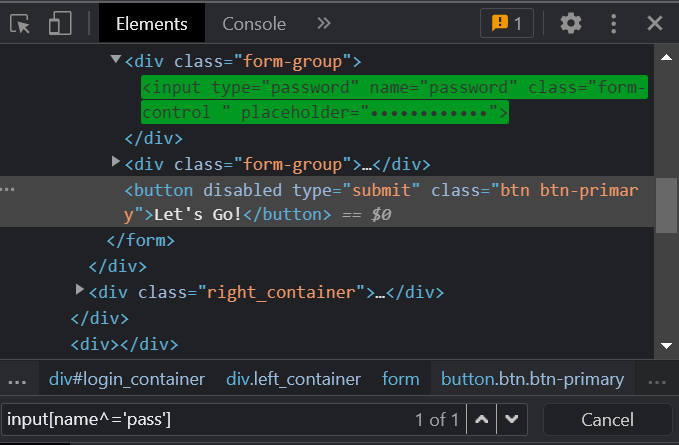
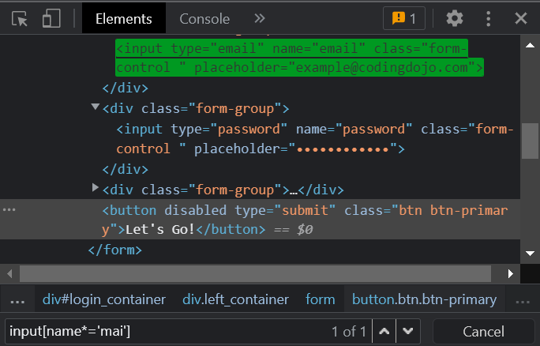
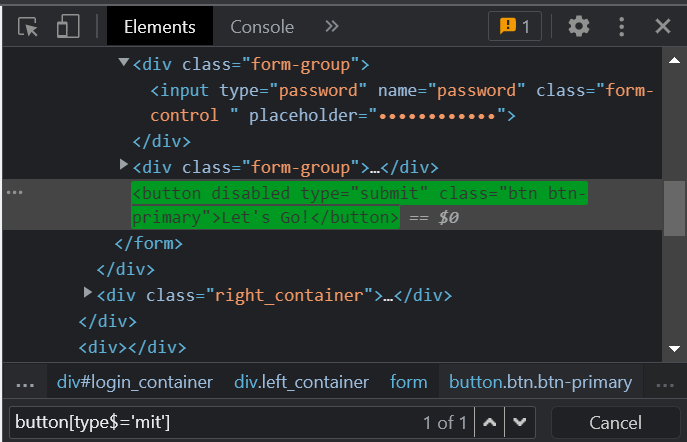

### CSSSelector using StartsWith, EndsWith, & Contains

### Source Code
```Java
package codingDojo;

import java.time.Duration;
import java.util.ArrayList;
import java.util.List;

import org.openqa.selenium.By;
import org.openqa.selenium.JavascriptExecutor;
import org.openqa.selenium.Keys;
import org.openqa.selenium.WebDriver;
import org.openqa.selenium.WebElement;
import org.openqa.selenium.WindowType;
import org.openqa.selenium.chrome.ChromeDriver;
import org.openqa.selenium.interactions.Actions;
import org.openqa.selenium.support.ui.ExpectedConditions;
import org.openqa.selenium.support.ui.Select;
import org.openqa.selenium.support.ui.WebDriverWait;
import org.testng.annotations.Test;

public class CodingDojo {

	public WebDriver driver;

	@Test
	public void codingDojo() throws InterruptedException {

		System.setProperty("webdriver.chrome.driver", "C:\\Users\\white\\Desktop\\QA\\Auto\\chromedriver.exe");

		driver = new ChromeDriver();
		// driver.manage().window().maximize();
		driver.navigate().to("https://login.codingdojo.com/login");

		// Contains "mai"
		String userNameTextBox = "input[name*='mai']";
		// starts-with "pass"
		String passTextBox = "input[name^='pass']";
		// ends-with "mit"
		String submitButton = "button[type$='mit']";

		// Waiting 10 seconds, until the user name <input> element is available.
		WebElement userName = (new WebDriverWait(driver, Duration.ofSeconds(10)))
				.until(ExpectedConditions.elementToBeClickable(By.cssSelector(userNameTextBox)));

		WebElement password = driver.findElement(By.cssSelector(passTextBox));
		WebElement submit = driver.findElement(By.cssSelector(submitButton));

		try {
			Thread.sleep(2000);
			userName.sendKeys("user@user.com");
			Thread.sleep(2000);
			password.sendKeys("fakePassword");
			Thread.sleep(2000);
			submit.click();
			// password.sendKeys(Keys.RETURN);
		} catch (InterruptedException e) {
			e.printStackTrace();
		}

		Thread.sleep(4000);
		driver.close();
	}
}

```

### The Result



