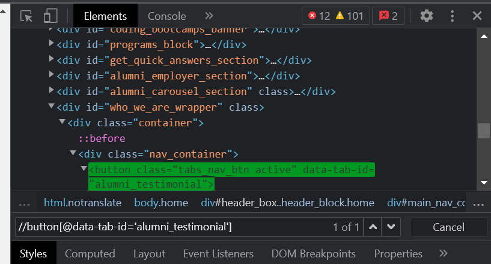
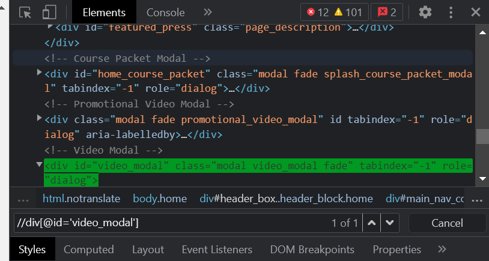
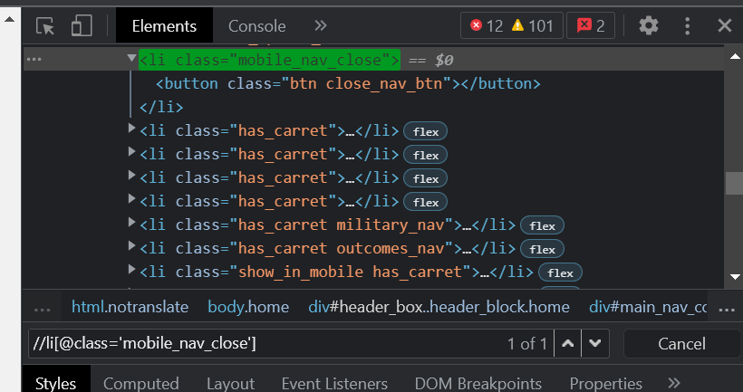

### Example for 'Basic' Type of XPath

### Source Code
```Java
package codingDojo;

import java.util.List;

import org.openqa.selenium.By;
import org.openqa.selenium.JavascriptExecutor;
import org.openqa.selenium.WebDriver;
import org.openqa.selenium.WebElement;
import org.openqa.selenium.chrome.ChromeDriver;
import org.testng.annotations.Test;

public class CodingDojo {
	
public WebDriver driver;
	
	@Test
	public void codingDojo() throws InterruptedException { 
		
		System.setProperty("webdriver.chrome.driver", "C:\\Users\\white\\Desktop\\QA\\Auto\\chromedriver.exe");
				
		driver = new ChromeDriver();
		//driver.manage().window().maximize();
		driver.navigate().to("https://www.codingdojo.com/");
		
		//Example for 'Basic' Type of XPath
		WebElement buttonElement = driver.findElement(By.xpath("//button[@data-tab-id='alumni_testimonial']"));
		String buttonResult = buttonElement.getText();
		System.out.println(buttonResult);
		
		WebElement divElement = driver.findElement(By.xpath("//div[@id='video_modal']"));
		String divResult = divElement.getText();
		System.out.println(divResult);
		
		WebElement liElement = driver.findElement(By.xpath("//li[@class='mobile_nav_close']"));
		String liResult = liElement.getText();
		System.out.println(liResult);

		driver.close();
	}
}
```

### The Result



