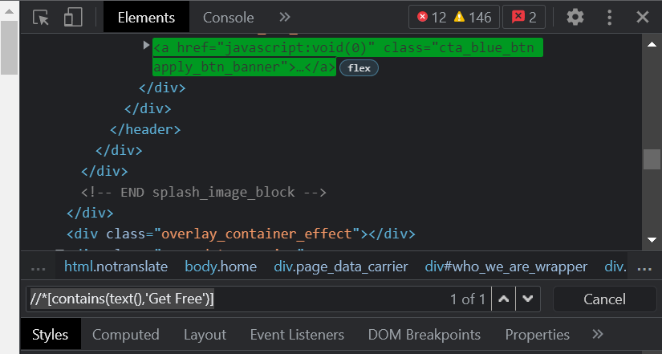

### Example for XPath using LinkText Locator

### Source Code
```Java
package codingDojo;

import java.util.List;

import org.openqa.selenium.By;
import org.openqa.selenium.JavascriptExecutor;
import org.openqa.selenium.WebDriver;
import org.openqa.selenium.WebElement;
import org.openqa.selenium.chrome.ChromeDriver;
import org.testng.annotations.Test;

public class CodingDojo {
	
public WebDriver driver;
	
	@Test
	public void codingDojo() throws InterruptedException { 
		
		System.setProperty("webdriver.chrome.driver", "C:\\Users\\white\\Desktop\\QA\\Auto\\chromedriver.exe");
				
		driver = new ChromeDriver();
		//driver.manage().window().maximize();
		driver.navigate().to("https://www.codingdojo.com/");
		
		// Example for XPath using LinkText Locator	
		WebElement element = driver.findElement(By.xpath("//*[contains(text(),'Get Free')]"));
		element.click();
		Thread.sleep(3000);
		
		driver.close();
	}
}

```

### The Result

