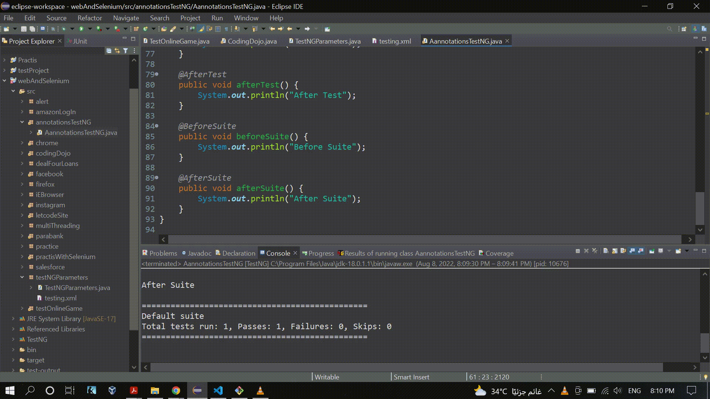

### Few Annotations using TestNG

### Source Code
```Java
package annotationsTestNG;

import org.openqa.selenium.By;
import org.openqa.selenium.WebDriver;
import org.openqa.selenium.WebElement;
import org.openqa.selenium.chrome.ChromeDriver;
import org.testng.Assert;
import org.testng.annotations.AfterClass;
import org.testng.annotations.AfterMethod;
import org.testng.annotations.AfterSuite;
import org.testng.annotations.AfterTest;
import org.testng.annotations.BeforeClass;
import org.testng.annotations.BeforeMethod;
import org.testng.annotations.BeforeSuite;
import org.testng.annotations.BeforeTest;
import org.testng.annotations.Test;

public class AannotationsTestNG {

	public WebDriver driver;

	// Test Case 1
	@Test(priority = 0)
	public void test2() throws InterruptedException {
		System.out.println("Test Case 1");
		// Contains "mai"
		String userNameTextBox = "input[name*='mai']";
		// starts-with "pass"
		String passTextBox = "input[name^='pass']";
		// ends-with "mit"
		String submitButton = "button[type$='mit']";
		String errParagraf = "/html/body/div[2]/div[2]/div[1]/form/div[1]/p";

		WebElement userName = driver.findElement(By.cssSelector(userNameTextBox));
		WebElement password = driver.findElement(By.cssSelector(passTextBox));
		WebElement submit = driver.findElement(By.cssSelector(submitButton));

		userName.sendKeys("user@user.com");
		password.sendKeys("1234");
		submit.click();
		Thread.sleep(2000);

		WebElement errMsg = driver.findElement(By.xpath("/html/body/div[2]/div[2]/div[1]/form/div[1]/p"));
		String result = errMsg.getText();
		Assert.assertEquals(result, "User not found in our database. Make sure your application was accepted.");

	}

	@BeforeMethod
	public void beforeMethod() {
		System.out.println("Before Method");
		System.setProperty("webdriver.chrome.driver", "C:\\Users\\white\\Desktop\\QA\\Auto\\chromedriver.exe");
		driver = new ChromeDriver();
		// driver.manage().window().maximize();
		driver.navigate().to("https://login.codingdojo.com/login");
	}

	@AfterMethod
	public void afterMethod() {
		System.out.println("After Method");
		driver.quit();
	}

	@BeforeClass
	public void beforeClass() {
		System.out.println("Before Class");
	}

	@AfterClass
	public void afterClass() {
		System.out.println("After Class");
	}

	@BeforeTest
	public void beforeTest() {
		System.out.println("Before Test");
	}

	@AfterTest
	public void afterTest() {
		System.out.println("After Test");
	}

	@BeforeSuite
	public void beforeSuite() {
		System.out.println("Before Suite");
	}

	@AfterSuite
	public void afterSuite() {
		System.out.println("After Suite");
	}
}
```

### The Result
