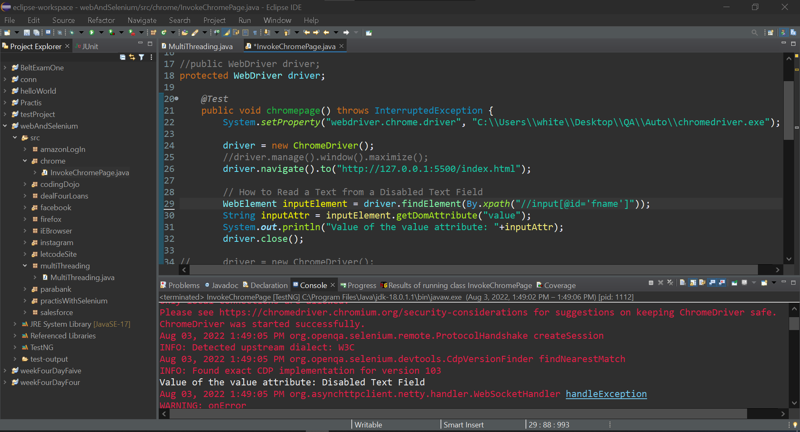
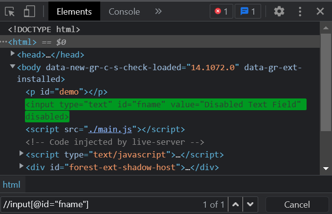

### How to Read a Text from a Disabled Text Field

### Source Code

### HTML File
```HTML
<!DOCTYPE html>
<html>
    <head>
        <title>
            Demo
        </title>
    </head>
    <body>
        <p id="demo"></p>
        <input type="text" id="fname" value="Disabled Text Field" disabled>
        <script src="./main.js"></script>
    </body>
</html>
```

### Java File
```Java
package codingDojo;

import java.util.List;

import org.openqa.selenium.By;
import org.openqa.selenium.JavascriptExecutor;
import org.openqa.selenium.WebDriver;
import org.openqa.selenium.WebElement;
import org.openqa.selenium.chrome.ChromeDriver;
import org.testng.annotations.Test;

public class CodingDojo {
	
public WebDriver driver;
	
	@Test
	public void codingDojo() throws InterruptedException { 
		
		System.setProperty("webdriver.chrome.driver", "C:\\Users\\white\\Desktop\\QA\\Auto\\chromedriver.exe");
				
		driver = new ChromeDriver();
		//driver.manage().window().maximize();
		driver.navigate().to("http://127.0.0.1:5500/index.html");
		
		// How to Read a Text from a Disabled Text Field
		WebElement inputElement = driver.findElement(By.xpath("//input[@id='fname']"));
		String inputAttr = inputElement.getDomAttribute("value");
		System.out.println("Value of the value attribute: "+inputAttr);
		Thread.sleep(4000);
		driver.close();
	}
}

```

### The Result


