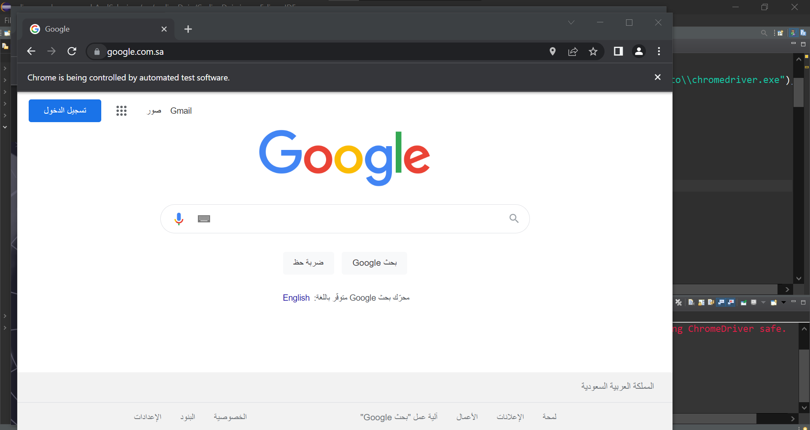
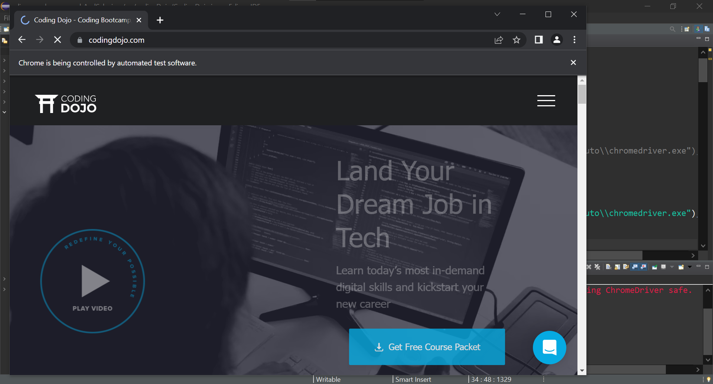

### Interacting with New Tab

### Source Code
### Open a new tab, a new window, and a private incognito window

### New Tab
```Java
package codingDojo;

import java.util.ArrayList;
import java.util.List;

import org.openqa.selenium.By;
import org.openqa.selenium.JavascriptExecutor;
import org.openqa.selenium.Keys;
import org.openqa.selenium.WebDriver;
import org.openqa.selenium.WebElement;
import org.openqa.selenium.chrome.ChromeDriver;
import org.openqa.selenium.interactions.Actions;
import org.testng.annotations.Test;

public class CodingDojo {
	
public WebDriver driver;
	
	@Test
	public void codingDojo() throws InterruptedException { 
		
		System.setProperty("webdriver.chrome.driver", "C:\\Users\\white\\Desktop\\QA\\Auto\\chromedriver.exe");
				
		driver = new ChromeDriver();
		//driver.manage().window().maximize();
		driver.navigate().to("https://www.codingdojo.com/");
		
		JavascriptExecutor js = (JavascriptExecutor)driver;
		js.executeScript("window.open()");
		ArrayList<String> tabs = new ArrayList<String>(driver.getWindowHandles());
		Thread.sleep(5000);

		//Switch to a new tab
		driver.switchTo().window(tabs.get(1));
		driver.get("http://google.com");Thread.sleep(5000);

		//switch back control to old tab
		driver.switchTo().window(tabs.get(0));
		Thread.sleep(5000);	
		driver.close();
	}
}
```
### The Result


### New window
```Java
package codingDojo;

import java.util.ArrayList;
import java.util.List;

import org.openqa.selenium.By;
import org.openqa.selenium.JavascriptExecutor;
import org.openqa.selenium.Keys;
import org.openqa.selenium.WebDriver;
import org.openqa.selenium.WebElement;
import org.openqa.selenium.WindowType;
import org.openqa.selenium.chrome.ChromeDriver;
import org.openqa.selenium.interactions.Actions;
import org.testng.annotations.Test;

public class CodingDojo {
	
public WebDriver driver;
	
	@Test
	public void codingDojo() throws InterruptedException { 
		
		System.setProperty("webdriver.chrome.driver", "C:\\Users\\white\\Desktop\\QA\\Auto\\chromedriver.exe");
				
		driver = new ChromeDriver();
		//driver.manage().window().maximize();
		driver.navigate().to("https://www.codingdojo.com/");
		
		// A new window is opened and switches to it
		driver.switchTo().newWindow(WindowType.WINDOW);
		// Loads Google website in the newly opened window
		driver.get("https://www.google.com.sa/");		
		Thread.sleep(5000);		
		driver.close();
	}
}

```
### The Result


### Private incognito window <p style={color='red'}>This code opens normal chrome window, not a Private incognito window</p>
```Java
package codingDojo;

import java.util.ArrayList;
import java.util.List;

import org.openqa.selenium.By;
import org.openqa.selenium.JavascriptExecutor;
import org.openqa.selenium.Keys;
import org.openqa.selenium.WebDriver;
import org.openqa.selenium.WebElement;
import org.openqa.selenium.WindowType;
import org.openqa.selenium.chrome.ChromeDriver;
import org.openqa.selenium.chrome.ChromeOptions;
import org.openqa.selenium.interactions.Actions;
import org.openqa.selenium.remote.DesiredCapabilities;
import org.testng.annotations.Test;

public class CodingDojo {
	
public WebDriver driver;
	
	@Test
	public void codingDojo() throws InterruptedException { 
				
		DesiredCapabilities capabilities = new DesiredCapabilities();
        ChromeOptions options = new ChromeOptions();
        options.addArguments("--incognito");
        capabilities.setCapability(ChromeOptions.CAPABILITY, options);
        System.setProperty("webdriver.chrome.driver", "C:\\Users\\white\\Desktop\\QA\\Auto\\chromedriver.exe");
        WebDriver driver = new ChromeDriver();
        driver.get("https://www.codingdojo.com/");
        System.out.println(driver.getTitle());
		
		Thread.sleep(5000);
		driver.close();
	}
}

```
### The Result

