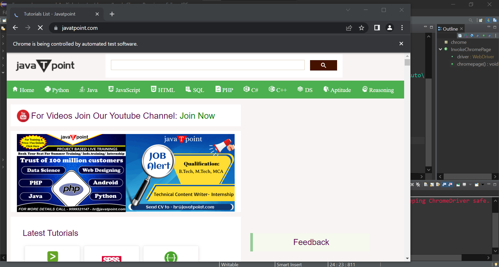

### Simple program in Java using Selenium to evoke the Chrome browser

### Source Code

```Java
package chrome;

import org.openqa.selenium.By;
import org.openqa.selenium.JavascriptExecutor;
import org.openqa.selenium.WebDriver;
import org.openqa.selenium.chrome.ChromeDriver;
import org.testng.annotations.Test;

public class InvokeChromePage {
	
public WebDriver driver;
	
	@Test
	public void chromepage() throws InterruptedException { 
		System.setProperty("webdriver.chrome.driver", "C:\\Users\\white\\Desktop\\QA\\Auto\\chromedriver.exe");
				
		driver = new ChromeDriver();
		driver.navigate().to("https://www.javatpoint.com/");
//		driver.manage().window().minimize();
		driver.manage().window().maximize();
		JavascriptExecutor js = (JavascriptExecutor)driver;
		js.executeScript("scrollBy(0, 5000)");
		driver.findElement(By.linkText("Learn Java")).click();
		Thread.sleep(7000);
		driver.close();
	}
}
```
### The Result
