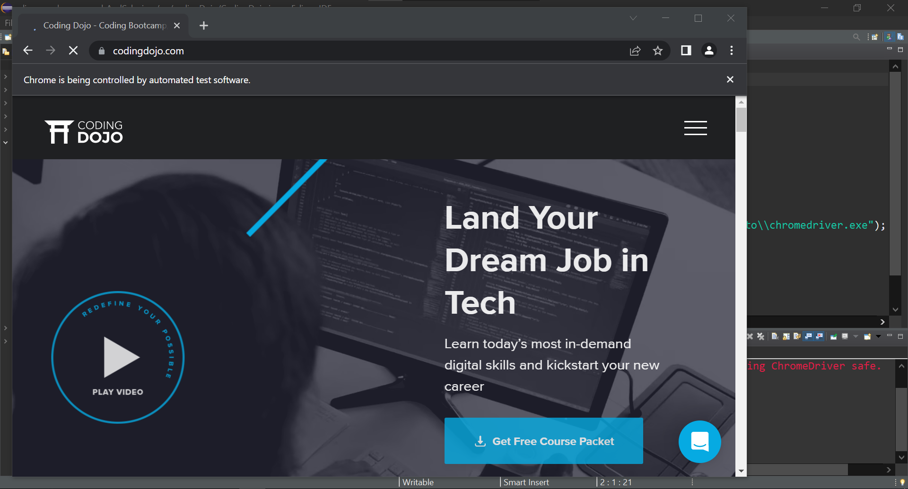

### Simple program in Java using Selenium to Ivoke CodingDojo

### Source Code

```Java
package codingDojo;

import org.openqa.selenium.WebDriver;
import org.openqa.selenium.chrome.ChromeDriver;
import org.testng.annotations.Test;

public class CodingDojo {
	
public WebDriver driver;
	
	@Test
	public void codingDojo() throws InterruptedException { 
		System.setProperty("webdriver.chrome.driver", "C:\\Users\\white\\Desktop\\QA\\Auto\\chromedriver.exe");
				
		driver = new ChromeDriver();
		driver.navigate().to("https://www.codingdojo.com/");
		driver.manage().window().maximize();
		Thread.sleep(4000);
		driver.close();
	}
}

```
### The Result
