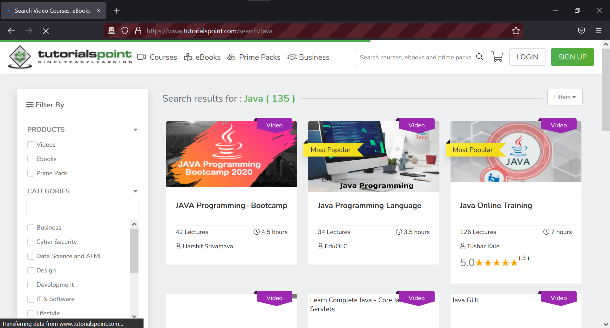

### Simple program in Java using Selenium to evoke the Firefox browser

* 
```Java
package firefox;

import org.openqa.selenium.By;
import org.openqa.selenium.JavascriptExecutor;
import org.openqa.selenium.WebDriver;
import org.openqa.selenium.firefox.FirefoxDriver;

public class InvokeFirefoxPage {
	
public static void main(String[] args) throws InterruptedException {
        
        //Creating a driver object referencing WebDriver interface
        WebDriver driver;
        
        //Setting webdriver.gecko.driver property
        System.setProperty("webdriver.gecko.driver", "C:\\Users\\white\\Desktop\\QA\\Auto\\geckodriver.exe" );
        
        //Instantiating driver object and launching browser
        driver = new FirefoxDriver();
        
        //Using get() method to open a web page
        driver.get("https://www.javatpoint.com/");
        
        driver.manage().window().maximize();
		JavascriptExecutor js = (JavascriptExecutor)driver;
		js.executeScript("scrollBy(0, 5000)");
		driver.findElement(By.linkText("Learn Java")).click();
		Thread.sleep(7000);
        
        //Closing the browser
        driver.quit();
 
    }
}
```

* The Result
