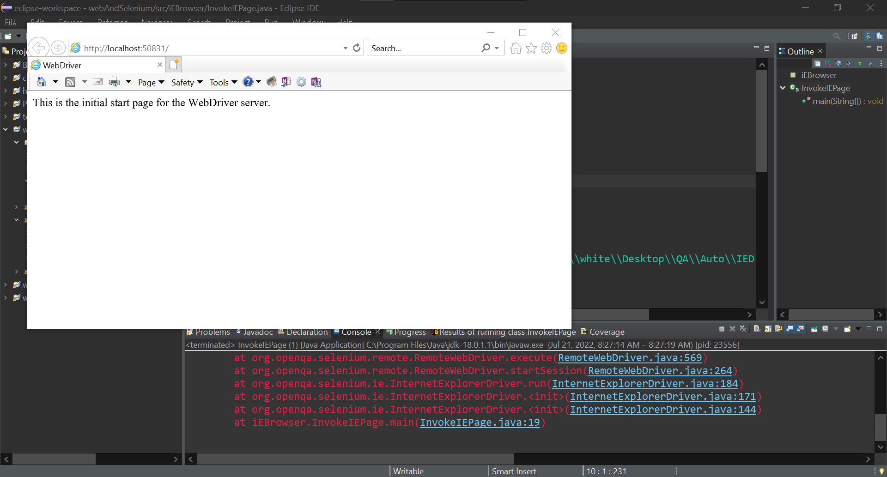

### Simple program in Java using Selenium to evoke the IE browser

* Source Code

```Java
package iEBrowser;


import java.util.concurrent.TimeUnit;

import org.openqa.selenium.By;
import org.openqa.selenium.WebDriver;
import org.openqa.selenium.WebElement;
import org.openqa.selenium.ie.InternetExplorerDriver;

public class InvokeIEPage {
	@SuppressWarnings("deprecation")
	public static void main(String[] args) {
		
        // System Property for IEDriver
		System.setProperty("webdriver.ie.driver", "C:\\Users\\white\\Desktop\\QA\\Auto\\IEDriverServer.exe");  
      
		//Creating an object of InternetExplorerDriver
		WebDriver driver=new InternetExplorerDriver();
//		driver.manage().window().maximize();
		driver.manage().window().minimize();

		//Deleting all the cookies
		driver.manage().deleteAllCookies();
		
		//Specifying pageLoadTimeout and Implicit wait
		driver.manage().timeouts().pageLoadTimeout(40, TimeUnit.SECONDS);
		driver.manage().timeouts().implicitlyWait(30, TimeUnit.SECONDS);


		//launching the specified URL
		driver.get("https://www.google.com/");
	}  
}
```

* The Result

