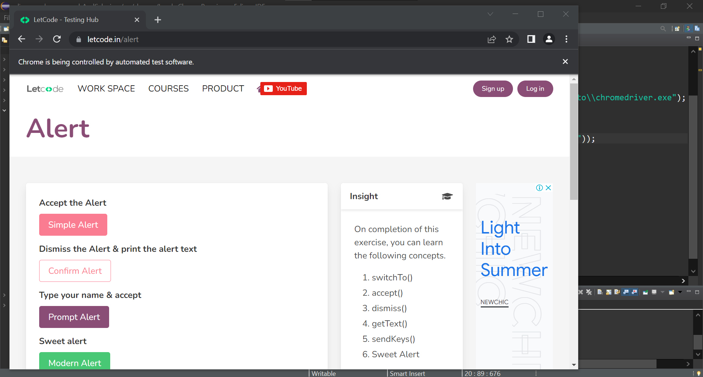
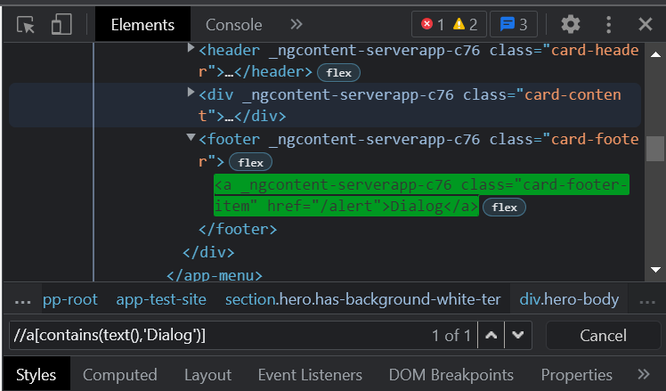

### Relative XPath

### Source Code
```Java
package chrome;

import org.openqa.selenium.By;
import org.openqa.selenium.JavascriptExecutor;
import org.openqa.selenium.WebDriver;
import org.openqa.selenium.WebElement;
import org.openqa.selenium.chrome.ChromeDriver;
import org.testng.annotations.Test;

public class InvokeChromePage {
	
public WebDriver driver;
	
	@Test
	public void chromepage() throws InterruptedException { 
		System.setProperty("webdriver.chrome.driver", "C:\\Users\\white\\Desktop\\QA\\Auto\\chromedriver.exe");
				
		driver = new ChromeDriver();
		driver.navigate().to("https://letcode.in/test");
		WebElement butElem = driver.findElement(By.xpath("//a[contains(text(),'Dialog')]"));
		butElem.click();
        
		Thread.sleep(4000);
		driver.close();
	}
}

```

### The Result

