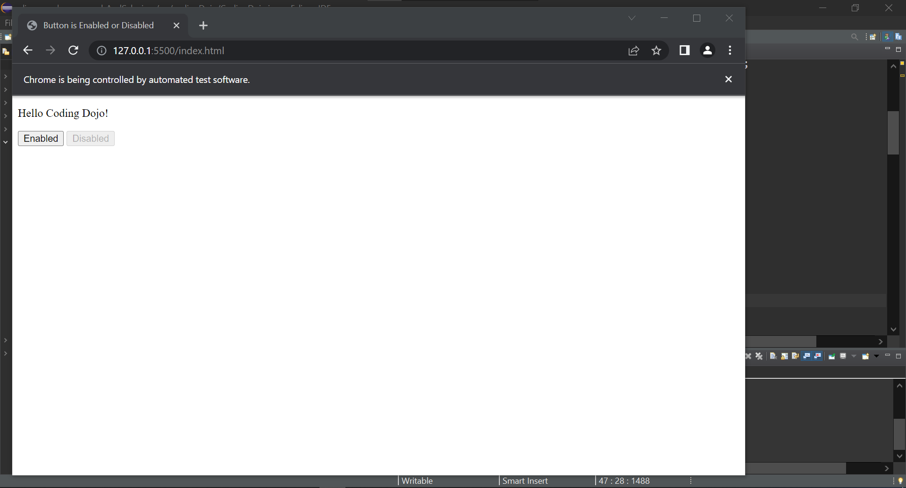
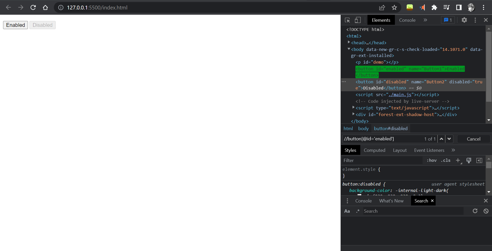
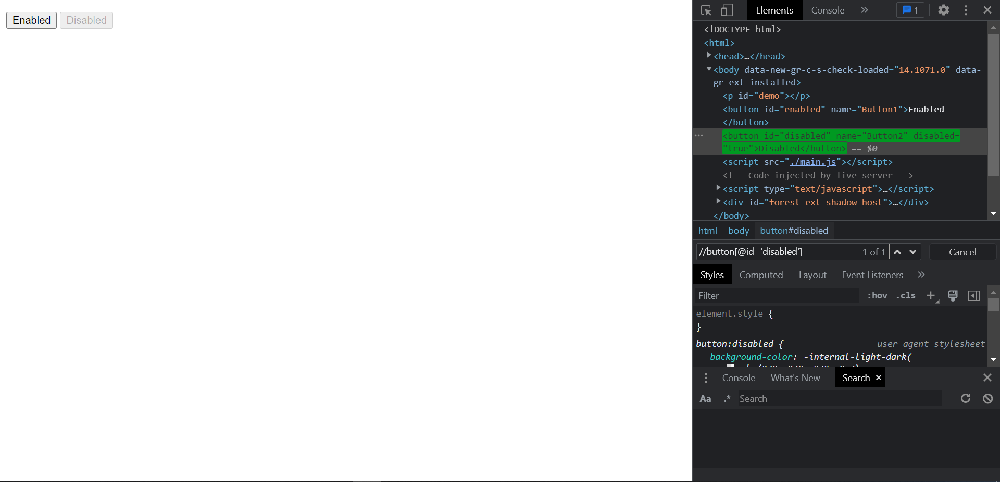
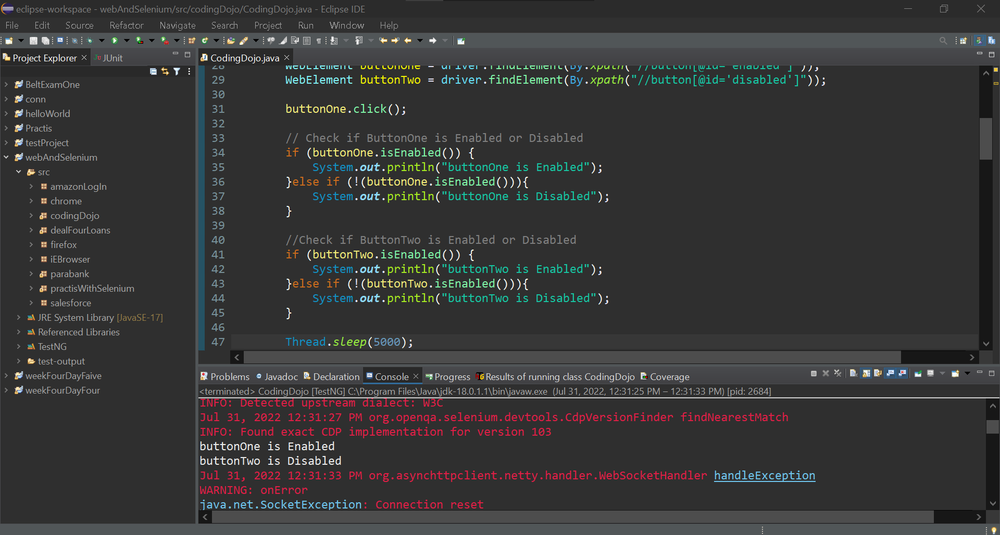

### Verifying Whether a Button is Enabled or Disabled

## Source Code
### HTML File

```html
<!DOCTYPE html>
<html>
    <head>
        <title>
            Button is Enabled or Disabled
        </title>
    </head>
    <body>
        <p id="demo"></p>
        <button id="enabled" name="Button1">Enabled</button>
        <button id="disabled" name="Button2" disabled="true">Disabled</button>
        <script src="./main.js"></script>
    </body>
</html>
```

### JavaScript File
``` JavaScript
const buttonElement = document.getElementById("enabled");
buttonElement.addEventListener("click", function() {
    document.getElementById("demo").innerHTML = "Hello Coding Dojo!";
  });
```

### Java File / Selenium with Java
```Java
package codingDojo;

import java.util.List;

import org.openqa.selenium.By;
import org.openqa.selenium.JavascriptExecutor;
import org.openqa.selenium.Keys;
import org.openqa.selenium.WebDriver;
import org.openqa.selenium.WebElement;
import org.openqa.selenium.chrome.ChromeDriver;
import org.openqa.selenium.interactions.Actions;
import org.testng.annotations.Test;

public class CodingDojo {
	
public WebDriver driver;
	
	@Test
	public void codingDojo() throws InterruptedException { 
		
		System.setProperty("webdriver.chrome.driver", "C:\\Users\\white\\Desktop\\QA\\Auto\\chromedriver.exe");
				
		driver = new ChromeDriver();

		driver.navigate().to("http://127.0.0.1:5500/index.html");
		
		WebElement buttonOne = driver.findElement(By.xpath("//button[@id='enabled']"));
		WebElement buttonTwo = driver.findElement(By.xpath("//button[@id='disabled']"));
		
		buttonOne.click();
		
		// Check if ButtonOne is Enabled or Disabled
		if (buttonOne.isEnabled()) {
			System.out.println("buttonOne is Enabled");
		}else if (!(buttonOne.isEnabled())){
			System.out.println("buttonOne is Disabled");
		}
		
		//Check if ButtonTwo is Enabled or Disabled
		if (buttonTwo.isEnabled()) {
			System.out.println("buttonTwo is Enabled");
		}else if (!(buttonTwo.isEnabled())){
			System.out.println("buttonTwo is Disabled");
		}
		
		Thread.sleep(5000);
		driver.close();
	}
}

```

### The Result



