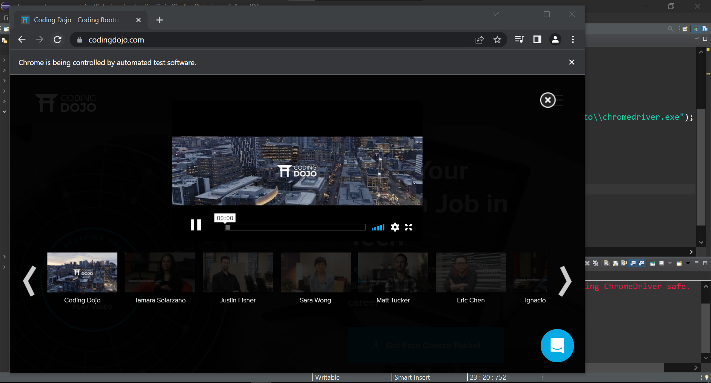

### Follow the below steps to locate web elements using Chrome’s Developer tool:

* Step #1: launch the Google Chrome’s Developer tool.


* Step #2: locate the desired object within the web page. Right-click on the desired web element and inspect. 


* Step #3: Click on Ctrl+F, and type 'cta_blue_button'

### Source Code
```Java
package codingDojo;

import org.openqa.selenium.By;
import org.openqa.selenium.JavascriptExecutor;
import org.openqa.selenium.WebDriver;
import org.openqa.selenium.WebElement;
import org.openqa.selenium.chrome.ChromeDriver;
import org.testng.annotations.Test;

public class CodingDojo {
	
public WebDriver driver;
	
	@Test
	public void codingDojo() throws InterruptedException { 
		System.setProperty("webdriver.chrome.driver", "C:\\Users\\white\\Desktop\\QA\\Auto\\chromedriver.exe");
				
		driver = new ChromeDriver();
		driver.navigate().to("https://www.codingdojo.com/");
		WebElement button = driver.findElement(By.className("cta_blue_button"));
		button.click();
		Thread.sleep(7000);
		driver.close();
	}
}

```

### The Result
