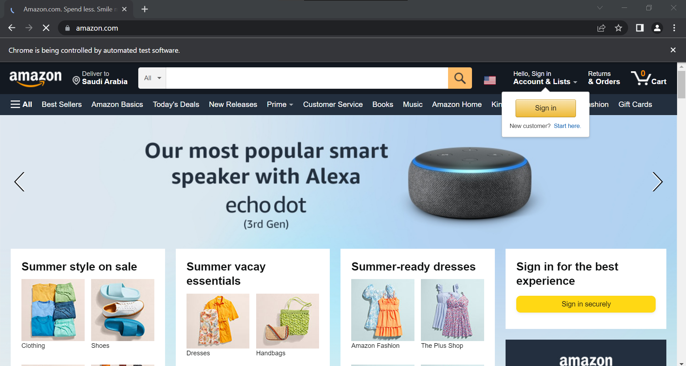
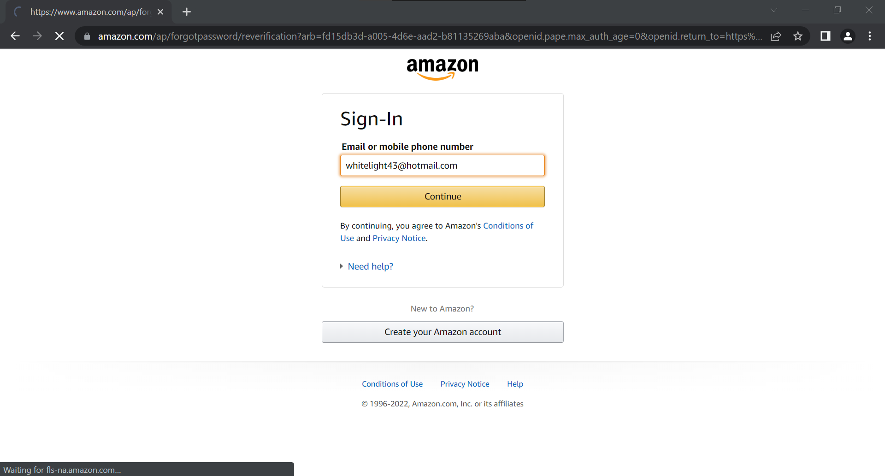
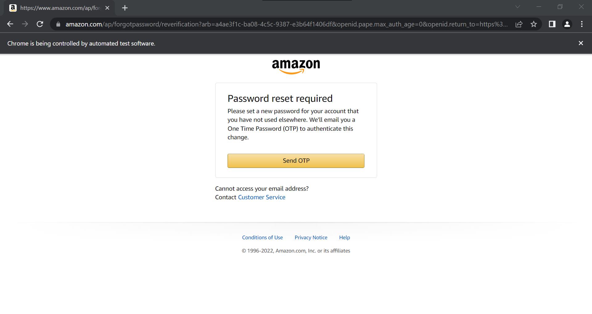
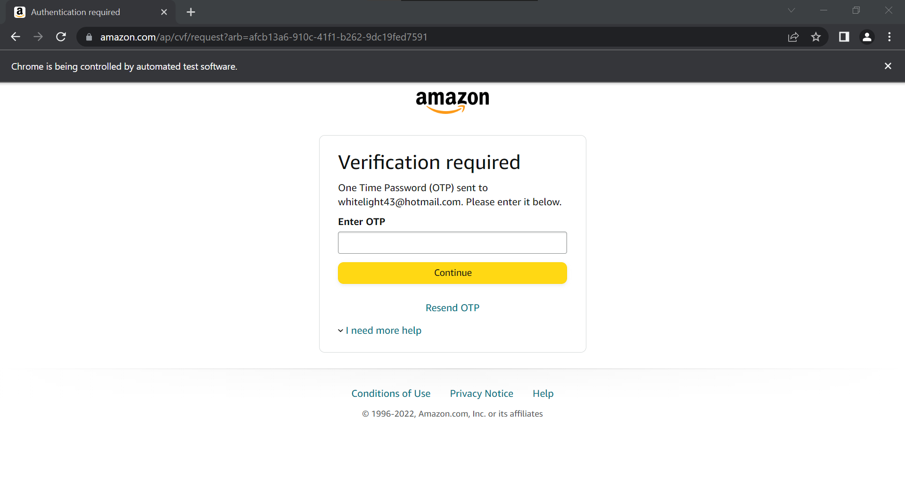

# Login to Amazon.com 
## Automated testing / Selenium with JAVA

### Source Code
```Java
package amazonLogIn;

import org.openqa.selenium.By;
import org.openqa.selenium.Keys;
import org.openqa.selenium.WebDriver;
import org.openqa.selenium.WebElement;
import org.openqa.selenium.chrome.ChromeDriver;
import org.testng.annotations.Test;

public class AmazonLogIn {

public WebDriver driver;
	
	@Test
	public void logIn() throws InterruptedException { 
		System.setProperty("webdriver.chrome.driver", "C:\\Users\\white\\Desktop\\QA\\Auto\\chromedriver.exe");
				
		driver = new ChromeDriver();
		driver.manage().window().maximize();
		driver.navigate().to("https://www.amazon.com/");
		Thread.sleep(9000);
		
		// Click on the Sign in button
		WebElement login = driver.findElement(By.partialLinkText("Sign in"));
		login.click();
		Thread.sleep(9000);
		
		// Enter valid Email & press ENTER
		WebElement textBox = driver.findElement(By.id("ap_email"));
		textBox.sendKeys("whitelight43@hotmail.com");
		textBox.sendKeys(Keys.RETURN);
		Thread.sleep(9000);
		
		// Click "Send OTP" to send the OTP to your Email
		WebElement butn = driver.findElement(By.id("continue"));
		butn.sendKeys(Keys.RETURN);
		Thread.sleep(9000);
		
		// until now, I don't know how I can connect between selenium and the Email Server.
		driver.close();
	}
}

```

### The Result





### until now, I don't know how I can connect between selenium and the Email Server.