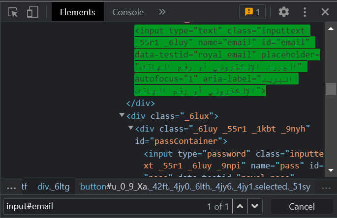
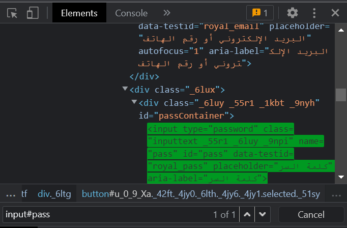
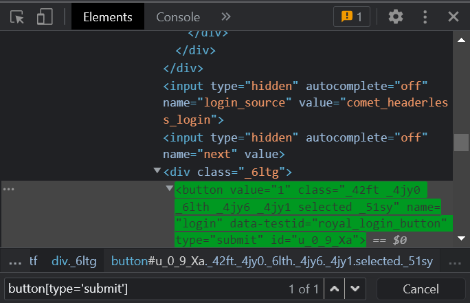

### Working with CSSSelector - Tag and ID

### Source Code
```Java
package facebook;

import org.openqa.selenium.By;
import org.openqa.selenium.Keys;
import org.openqa.selenium.WebDriver;
import org.openqa.selenium.WebElement;
import org.openqa.selenium.chrome.ChromeDriver;
import org.testng.annotations.Test;

public class Facebook {

public WebDriver driver;
	@Test
	public void facebookpage() throws InterruptedException {
		System.setProperty("webdriver.chrome.driver", "C:\\Users\\white\\Desktop\\QA\\Auto\\chromedriver.exe");
		driver = new ChromeDriver();
		driver.navigate().to("https://www.facebook.com/");
		
		String userNameTextBox = "input#email";
		String passTextBox = "input#pass";
		String submitButton = "button[type='submit']";
		
		WebElement userName = driver.findElement(By.cssSelector(userNameTextBox));
		WebElement password = driver.findElement(By.cssSelector(passTextBox));
		WebElement submit = driver.findElement(By.cssSelector(submitButton));
		
		userName.sendKeys("user@user.com");
		Thread.sleep(2000);		
		password.sendKeys("fakePassword");
		Thread.sleep(2000);
		submit.click();
		//password.sendKeys(Keys.RETURN);
		Thread.sleep(4000);
		driver.close();
	}
}
```

### The Result



