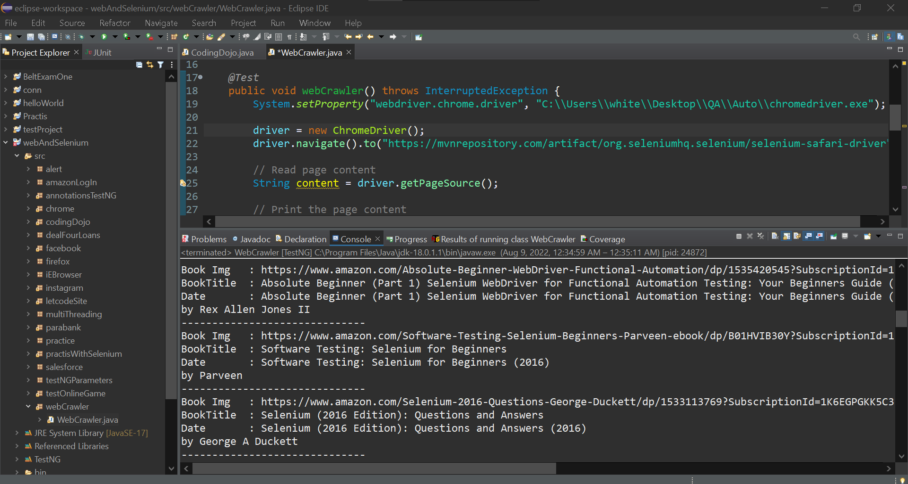

### Working with web Crawler using Selenium

### Source Code
```Java
package webCrawler;

import java.util.List;

import org.openqa.selenium.By;
import org.openqa.selenium.WebDriver;
import org.openqa.selenium.WebElement;
import org.openqa.selenium.chrome.ChromeDriver;
import org.testng.annotations.Test;

import com.google.common.collect.Iterables;

public class WebCrawler {

	public WebDriver driver;

	@Test
	public void webCrawler() throws InterruptedException {
		System.setProperty("webdriver.chrome.driver", "C:\\Users\\white\\Desktop\\QA\\Auto\\chromedriver.exe");

		driver = new ChromeDriver();
		driver.navigate().to("https://mvnrepository.com/artifact/org.seleniumhq.selenium/selenium-safari-driver");

		// Read page content
		String content = driver.getPageSource();

		// Print the page content
		//System.out.println(content);

		// Finding particular web element from the web page using Xpath
		WebElement table = driver.findElement(By.xpath("//*[@id=\"maincontent\"]/div[4]/div/table"));

		// Iterating through table rows
		List<WebElement> rowsList = table.findElements(By.tagName("tbody"));

		for (WebElement rows : rowsList) {
			// Iterate through each row and find <tr>
			for (WebElement row : rows.findElements(By.tagName("tr"))) {
				// Get all anchor tags
				List<WebElement> attributes = row.findElements(By.tagName("a"));

				// Find Elements by using anchor and then use index to retrieve data in each
				// column of the table
				WebElement bookImg = attributes.get(0);
				WebElement bookTitle = attributes.get(1);

				WebElement date = Iterables.getLast(row.findElements(By.tagName("td")));

				System.out.println("Book Img   : " + bookImg.getAttribute("href"));
				System.out.println("BookTitle  : " + bookTitle.getText());

				System.out.println("Date       : " + date.getText());
				System.out.println("##############################");
			}
		}

		driver.quit();
	}
}

```

### The Result

