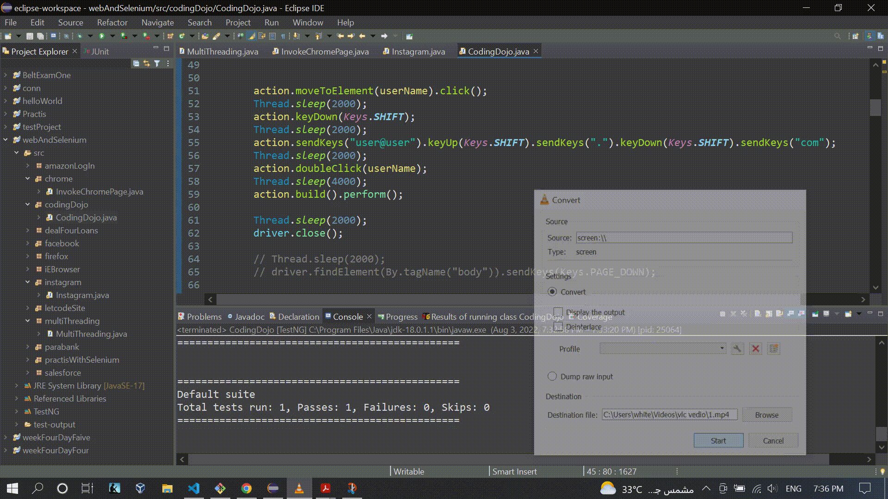

### Working with keyUp and keyDown

### Source Code
```Java
package codingDojo;

import java.awt.Desktop.Action;
import java.time.Duration;
import java.util.ArrayList;
import java.util.List;

import org.openqa.selenium.By;
import org.openqa.selenium.JavascriptExecutor;
import org.openqa.selenium.Keys;
import org.openqa.selenium.WebDriver;
import org.openqa.selenium.WebElement;
import org.openqa.selenium.WindowType;
import org.openqa.selenium.chrome.ChromeDriver;
import org.openqa.selenium.interactions.Actions;
import org.openqa.selenium.support.ui.ExpectedConditions;
import org.openqa.selenium.support.ui.Select;
import org.openqa.selenium.support.ui.WebDriverWait;
import org.testng.annotations.Test;

public class CodingDojo {

	public WebDriver driver;

	@Test
	public void codingDojo() throws InterruptedException {

		System.setProperty("webdriver.chrome.driver", "C:\\Users\\white\\Desktop\\QA\\Auto\\chromedriver.exe");

		driver = new ChromeDriver();
		// driver.manage().window().maximize();
		Actions action = new Actions(driver);
		driver.navigate().to("https://login.codingdojo.com/login");

		// Contains "mai"
		String userNameTextBox = "input[name*='mai']";

		WebElement userName = driver.findElement(By.cssSelector(userNameTextBox));	
		
		action.moveToElement(userName).click();
		Thread.sleep(2000);
		action.keyDown(Keys.SHIFT);
		Thread.sleep(2000);
		action.sendKeys("user@user").keyUp(Keys.SHIFT).sendKeys(".").keyDown(Keys.SHIFT).sendKeys("com");
		Thread.sleep(2000);
		action.doubleClick(userName);
		Thread.sleep(4000);
		action.build().perform();
		
		Thread.sleep(2000);
		driver.close();
	}
}

```

### The Result
